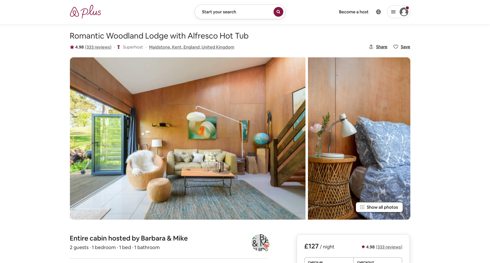

# Project-3 - PLATESTER 🍽

## Project Members:
- [Issra Hashim](https://github.com/IssraHashim/)
- [Mariah Gilling](https://github.com/msgilling)
- [Ed Steer](https://github.com/EdSteer)
- [Lee Wiseman](https://github.com/leewiseman94)

## Overview
**Platester** is an Airbnb clone that is an online recipe compendium about quality, homemade food that everyone can enjoy together. Users can upload, edit and delete their own recipes, for their own records or to share with others. Here, user’s can review each other's recipes and give a rating. They can also like/favourite recipes to save to their own profile.

## Find the deployed app here: [platester](https://platester.herokuapp.com/)
We deployed the website using Heroku, which is a free server that sleeps when it is not in use. Please allow it a minute or two to wake up and get going! 💤

Feel free to register your own account, or you can use mine:
- ree@admin.com
- ree

## Brief
To create a full-stack app using Node.js, Express and MongoDB. The app should have CRUD functionality and should contain several models and relationships.

**Timeframe: 8 days**

## Technologies
### Backend:
MongoDB/Mongoose
Express
JWT
BCrypt

### Front-end:
React.js
Axios
Bulma
CSS
React Router Dom

### Development Tools:
VSCode
Yarn
Insomnia
Trello Board (for planning)
Google Jamboard (wireframing)
Google Chrome dev tools
Git + Github
Zoom
Slack

### Other
Procreate (for the logo and icons)

## Approach taken
### Planning:
We all agreed straight away that we wanted to do daily stand-ups twice a day with each other so we knew where everyone was at and if anyone needed any assistance.. At the end of each day we would merge one by one and fix any merge conflicts together. worked together throughout the day through Zoom. This was a great way of working, so that in case one of us was stuck we all pitched in where we could.

Since this was a group project, we decided to code the Backend all together as a group, then each take ownership of a Frontend element of the app. Lee did the UserProfile, Filtering, and Navbar, Issra did the Authentication, Reviews and AddRecipe and UpdateRecipe, Ed did the Homepage, Footer and Cooking Classes and I did the RecipeIndex and RecipeShow pages. Issra and I also pair coded on the Inspirations page together.

We used Trello to divide all of our tasks:

Relationships:

Wireframing:

##  Backend:
We decided as a group to code the Backend together, where we took it in turns to write the code, while screen sharing. This was really beneficial as then the rest of the team could check over the code as it was being typed and research into any errors that may have occurred. We planned out what models, controllers and routes we needed and whether aspects of our models would be referenced or embedded.

Here is an example of our recipe controllers for adding and getting a single recipe:

By this point, we needed to start adding data and seeding the database with recipes to check it all worked through Insomnia and so we had material to work with.

Seeded recipe:

As we wanted our app to look fully built at then end of the project we added about 20 recipes each to bulk out the app so we had a lot of data we could work with. 

## Frontend:
Once the Backend was created, we took ownership of certain sections of the Frontend. We created our React app and worked mostly individually on our tasks. In Procreate I quickly designed and imported our app logo and icons we would be using. 

I wrote the AXIOS GET requests to display all the info about the recipes on our “show all/index” page. I then used the map function to iterate over each recipe and create individual cards for each one with Bulma CSS.

Displaying each recipe card:

Recipe card:

My Recipe Index page:

Airbnb Index page:

For the RecipeShow component I created the file and imported the required packages. I then made sure to make an AXIOS request to check I was retrieving the right data. To do this, I used the useEffect() function to make a request to our API. I also made sure to use an async/await so that the data was being grabbed in the right order. 

useEffect() code:

Because I set the data to an empty object within a useState() function, I could now access this information with dot notation and display the required information in return.

Example of accessing specified information through dot notation:

I definitely preferred to style as I went along, so that if we ran out of time we would not be rushing at the end of the week doing CSS. As we were aiming for an Airbnb clone site, I really wanted to make sure it was recognisable straight away.

I was really happy with how my styling for the index and show pages turned out, much like Airbnbs index and show page but with our own <i>platester</i> twist.

Recipe show page:

Airbnb show page:

## Bugs
Improve styling on the Recipe show page could have been more fluid with the responsiveness.

## Challenges
Customising with Bulma. We didn’t want to risk learning a new CSS Framework when we wanted our app to be a clone of a recognisable website, we thought using something familiar would be better. This meant sometimes we had to pair code to make sure everything was nested correctly as sometimes what we tried to style didn’t work how we wanted to.
I found trying to style the Recipe Show page as closely to the Airbnb show page a bit tricky with only one image and more information but glad with what I ended up with in the final outcome.

## Wins
Working in a team was a great learning experience. I really liked how well we communicated with daily stand ups and merging together at the end of the day in case any merge conflicts came about.
I was super happy that my logo fitted well with the app.
The user flow and mobile responsiveness of the app was super rewarding, I think it really takes it to the next level when it looks good not only on desktop but mobile too.
Being able to ask my team questions and to bounce ideas off of was great. I really enjoy working with others and helping them if they needed any assistance too.

## Key Learnings
I enjoyed using Bulma due to its built in styling but found it was a bit long winded having to nest divs and such.
Working as a team was a great learning experience as our individual strengths and weaknesses were balanced quite well.It was great how supportive and willing to help one another.
Working together to get the backend done was super beneficial to us as we finished the backend in about two days. This really helped us have as much time as possible with the frontend functionality and styling.

## Future Features
For users to have an option to upload a profile picture and edit their profile and follow other users.
The ability for there to be a blog/thread that users can upload their thoughts or problems in regards to cooking and help each other out.
The ability to link recipes to their users so other users can check out what they have uploaded.

